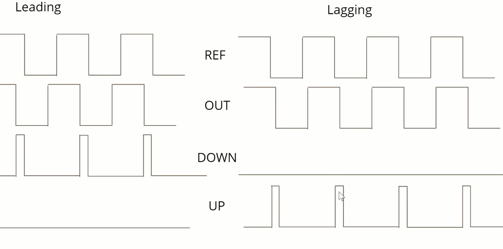
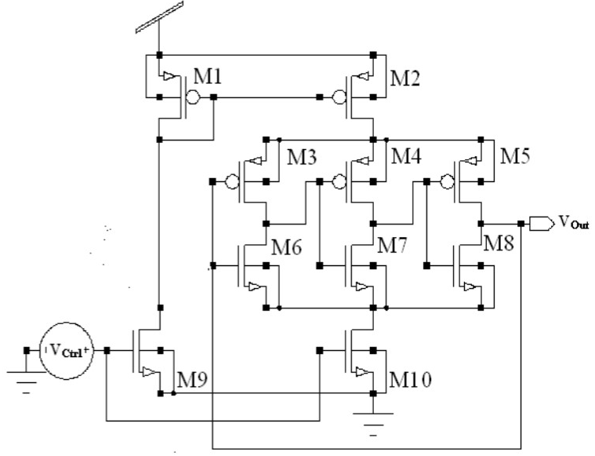

Contents

[Introduction to PLL	1](#_Toc78833501)

>   [What is pll ?	1](#_Toc78833502)

>   [Voltage controller oscillators	1](#_Toc78833503)

>   [Quartz crystals	1](#_Toc78833504)

>   [Why pll ?	1](#_Toc78833505)

>   [Pll Components	2](#_Toc78833506)

>   [Introduction to Phase Frequency Detector	2](#_Toc78833507)

>   [Phase Frequency Detector	2](#_Toc78833508)

>   [Charge Pump	5](#_Toc78833509)

>   [Voltage Controlled Oscillator	6](#_Toc78833510)

>   [Lock Range	6](#_Toc78833511)

>   [Capture Range	6](#_Toc78833512)

>   [Settling Time	6](#_Toc78833513)

[Development Flow	6](#_Toc78833514)

>   [PLL Specifications	7](#_Toc78833515)

>   [Frequency divider simulation and trans analysis	7](#_Toc78833516)

>   [Charge pump simulation and Trans analysis	9](#_Toc78833517)

>   [VCO Trans analysis	9](#_Toc78833518)

>   [PD Trans analysis	10](#_Toc78833519)

>   [Layout for frequency divider circuit	10](#_Toc78833520)

>   [Layout for Charge Pump circuit	11](#_Toc78833521)

>   [Layout for VCO circuit	11](#_Toc78833522)

>   [Extracting PFD to spice file	12](#_Toc78833523)

>   [Post Synthesis Layout of PFD	12](#_Toc78833524)

# 

# 

# 

# 

# 

# Introduction to PLL

-   Phase locked loop IC design using opensource tool & 130nm Sky water lake
    PDK.

## What is pll ?

-   Circuit to generate a precise clock signal with flexibility to run with
    frequency if our choice.

-   To generate a clock signal there are two way and they are quartz crystal and
    voltage control oscillators

## Voltage controller oscillators

-   They can be implemented on chip easily with inverters and we can control
    their frequency with an input voltage

-   The issue with this oscillators is they tend to have noise and fluctuations
    in their phase.

## Quartz crystals

-   They have pure spectrum without unwanted frequencies.

-   It is designed to give certain frequency alone and aren’t flexible like
    voltage controllers.

## Why pll ?

-   To get clock edges at the right time at all the flipflops without any delay
    and noise

-   To lock the frequency with reference frequency

-   The below diagram shows pure spectrum and noisy spectrum

Phase-locked loop Intuition

-   To have a single or multiple of the reference frequency and a constant phase
    difference.

-   Simplified diagram of PLL control System below

-   

-   The above system takes the input and compare the input with the reference
    signal and produces the output signal with similar to reference signal

-   The issue is there is always slight error that we can never correct but the
    signal will be almost equal.

## Pll Components

-   

-   Here VCO is onchip oscillator

-   Phase Frequency Detector takes care of comparison between output
    signal(feedback signal) with reference signal.

-   Charge pump converts the digital comparison output of phase frequency signal
    to analog that converts the frequency of VCO

-   Low pass filter (LPF) is to smoothen the CP output signal.

-   Frequency divider converts the whole system in to frequency multiplier.

## Introduction to Phase Frequency Detector

### Phase Frequency Detector

-   Detection of frequency difference between reference and the output signal.

-   Two possible difference is possible and they are leading and lagging as
    shown below

-   Leading signal

-   Lagging signal

-   The problem in the above leading and lagging signal is XOR of Ref and Output
    signal is same. So to distinguish between the we add two signal UP and Down.
    So when falling edge of out is detected before ref signal down is detected
    and when falling edge of ref is detected before then up signal is detected
    as shown below.

-   

-   

-   When down signal is detected then we slow down the phase frequency and when
    up signal is detected we increase the phase frequency

-   The state machine for Phase frequency detector is shown below

-   

-   

-   When the reference signal is slower the up is detected and when out signal
    is slower then down signal is detected

-   Implementation of above state machine with flipflops is shown below

-   

-   The issue with this circuit is the dead zone where the precision of
    difference in phase or frequency is can it detect which is hard to avoid.

-   This can only be avoided with precise PFD.

## Charge Pump

-   Convert the digital signal to the analog signal for controlling the
    oscillator

-   Thumb Rule Cx \~=C/10

-   Loop Filter B.W \~=(Highest Output Frequency)/10

-   Circuit for Charge Pump is as shown below

-   

## Voltage Controlled Oscillator 

-   

-   VCO is used to generate the required phase frequency corresponding to the
    voltage supplied.

-   

-   

## Lock Range

-   Frequency range that the PLL is able to follow the input frequency when the
    variation is locke

## Capture Range

-   When PLL is able to lock-in for a frequency range when starting from an
    unlocked condition.

## Settling Time

-   Time required for the PLL to lock-in from an unlocked condition

# Development Flow

-   Spice-level circuit Development

-   Pre-Layout Simulation

-   Layout Development

-   Parasitic Extraction

## PLL Specifications

-   Corner – ‘TT’

-   Supply Voltage – 1.8V

-   Room Temperature

-   VCO mode and PLL mode

-   Input Fmin = 5Mhz

-   Fmax = 12.5Mhz

-   Multiplier -8x

-   Jitter (RMS) \<\~20ns

-   Duty Cycle – 50%

## Frequency divider simulation and trans analysis

## Charge pump simulation and Trans analysis

## VCO Trans analysis

## PD Trans analysis

## Layout for frequency divider circuit

## Layout for Charge Pump circuit

## Layout for VCO circuit

## Extracting PFD to spice file

## Post Synthesis Layout of PFD

